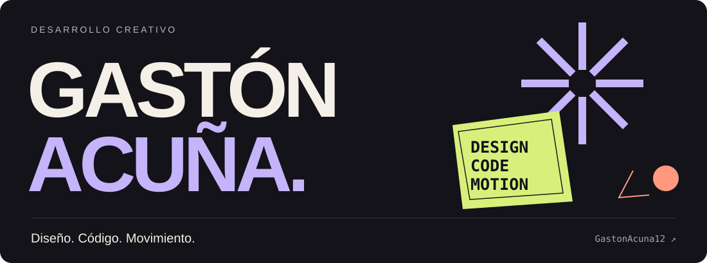
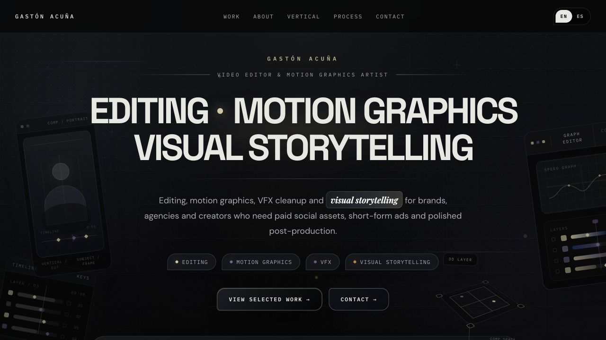
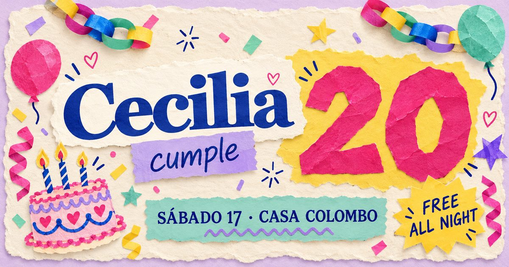
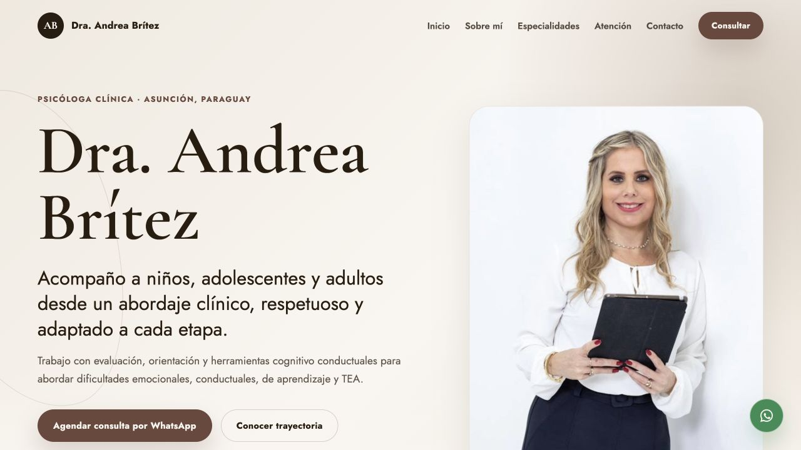
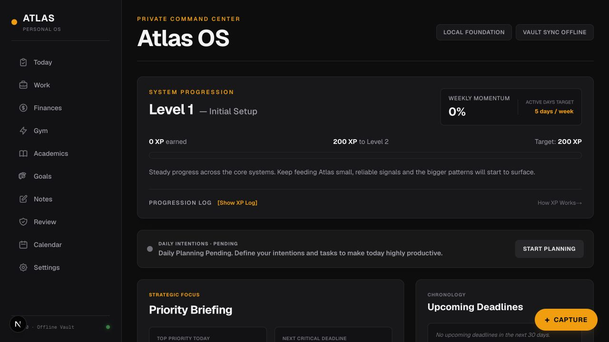

  

  <a href="#trabajo-seleccionado">Trabajo seleccionado</a> ·
  <a href="#diseño-código-y-movimiento">Cómo trabajo</a> ·
  <a href="https://www.linkedin.com/in/gast%C3%B3n-acu%C3%B1a-9b065735b/">LinkedIn</a>

Soy **Gastón Acuña**. Desarrollo experiencias web con diseño, animación e interacción. Mi trabajo en edición y motion graphics también influye en cómo pienso el ritmo, la composición y los detalles de una interfaz.

## Trabajo seleccionado

<table>
<tr>
<td width="50%" valign="top">

<h3>Portfolio audiovisual</h3>

Edición, motion y narrativa visual en una web con escenas animadas, galería de vídeo vertical y contenido en español e inglés.

React · Vite · Motion · Tailwind CSS

<a href="https://github.com/GastonAcuna12/EditingPortafolio">Explorar proyecto ↗</a>

</td>
<td width="50%" valign="top">

<h3>Invitaciones animadas</h3>

Papel que se despliega, recortes independientes y movimiento por fotogramas. Dos invitaciones con personalidad propia, pensadas para móvil.

JavaScript · Canvas · CSS · Animación por capas

<a href="https://ceci20.party/">Ver Cecilia ↗</a> · <a href="https://thais16.online/">Ver Thais ↗</a>

</td>
</tr>
<tr>
<td width="50%" valign="top">

<h3>Andrea Brítez</h3>

Una web profesional de estética editorial. Jerarquía tipográfica, una paleta cálida y transiciones sutiles para acompañar la lectura.

HTML · CSS · JavaScript · Diseño editorial

<a href="https://github.com/GastonAcuna12/andrea-britez-portafolio">Explorar proyecto ↗</a>

</td>
<td width="50%" valign="top">

<h3>Atlas Personal OS</h3>

Una aplicación para organizar planificación, hábitos, notas, tareas y objetivos. Un lenguaje visual sobrio para un sistema de uso diario.

Next.js · TypeScript · React · Local-first

<a href="https://github.com/GastonAcuna12/AtlasPersonalOS">Explorar proyecto ↗</a>

</td>
</tr>
</table>

## Diseño, código y movimiento

- **Composición:** tipografía, contraste y jerarquía que hacen comprensible una pantalla.
- **Interacción:** pequeñas respuestas visuales y transiciones que acompañan lo que hace la persona.
- **Movimiento:** desde animaciones suaves hasta recortes con fotogramas sostenidos, según el carácter de cada proyecto.

Trabajo con **HTML, CSS, JavaScript, React, TypeScript y Next.js**. Para el movimiento web, uso **Motion, Canvas y animación SVG** cuando el proyecto lo necesita.

---

¿Tenés un proyecto en mente? [Conectemos en LinkedIn ↗](https://www.linkedin.com/in/gast%C3%B3n-acu%C3%B1a-9b065735b/)
